# ✨ Cover Letter AI

🎯 Cover Letter AI 是一款結合 AI 智慧生成技術 與 Streamlit 打造的自薦信輔助工具，能根據使用者的履歷與職缺描述，自動撰寫客製化的求職自我推薦信。

目的是幫助求職者快速產出高品質的求職信，提升應徵效率與命中率，讓每一次投遞都更有價值。

[🔗 立即體驗 Cover Letter AI →](https://coverletterai.azurerain4u.top)

## 🚀 專案特色

- 🔍 智能擷取職缺關鍵字：自動擷取 104 人力銀行上的職缺內容，萃取技能與關鍵描述。

- 🤖 AI 自動生成推薦信：根據職缺內容與個人履歷比對，自動產出量身打造的 Cover Letter。

- 📎 支援 PDF 履歷上傳：可上傳 PDF 履歷或手動輸入，自由選擇使用方式。

- 🖥️ 友善的圖形化介面：採用 Streamlit 打造直覺式操作介面。

- ✨ 高品質的客製化：可自行輸入自我介紹亮點與提供補充技能，建立個人化風格。

- 🔄 即時編輯與再生成：不滿意第一次生成結果？可調整參數或內容重新生成。

## 截圖

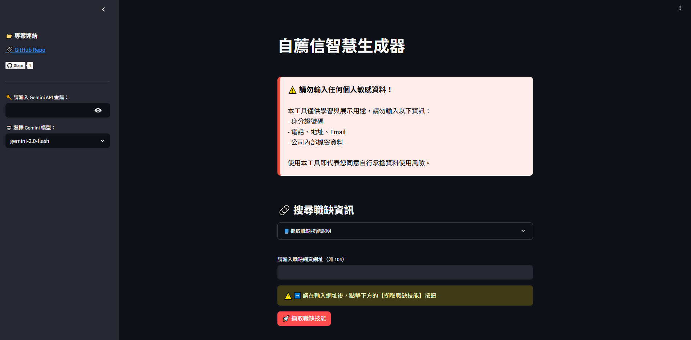

## 使用流程說明

### 輸入Gemini API Key 與 選擇模型版本

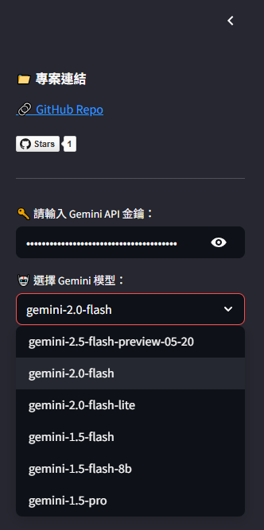
 
### 在輸入框中輸入職缺網址（目前只支援104）

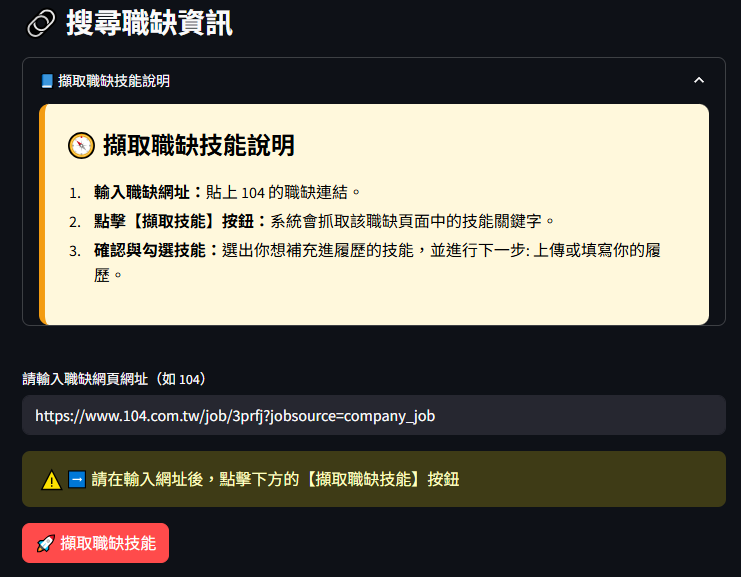

### 點擊【擷取技能】按鈕，擷取網頁中的技能描述

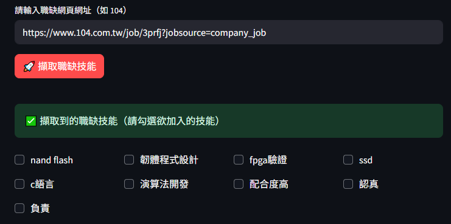

### 勾選你具備的技能項目

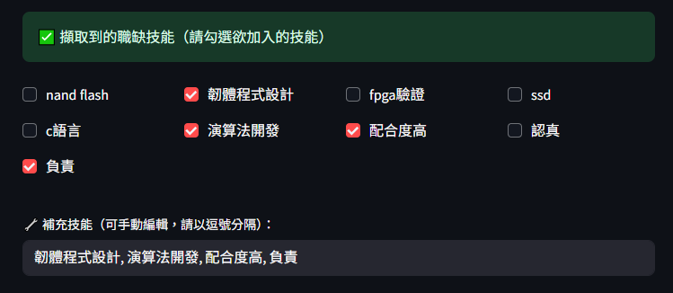

### 上傳 PDF 履歷，或手動輸入履歷內容

請勿上傳個人敏感資訊，例如：

1. 身分證字號、護照號碼

2. 手機號碼、電子郵件地址

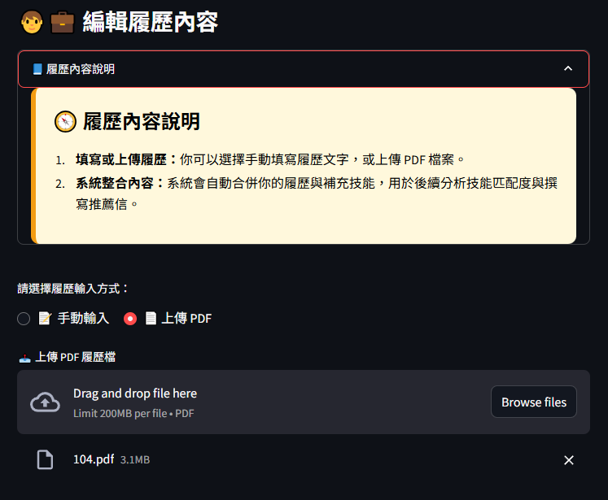

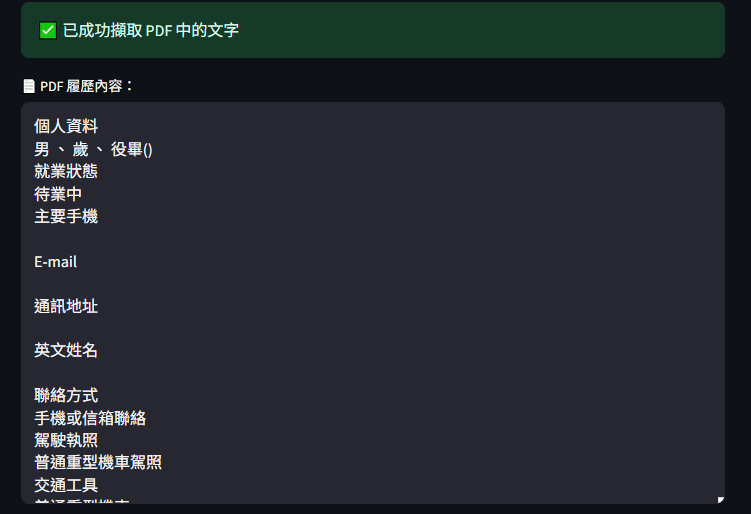

### 點擊【送出分析】，系統會自動產出推薦內容

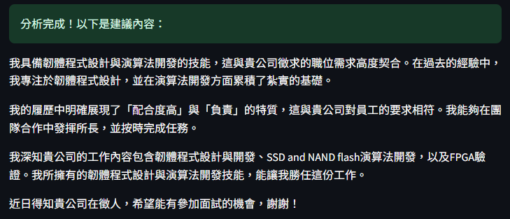

### 技能匹配度與命中技能

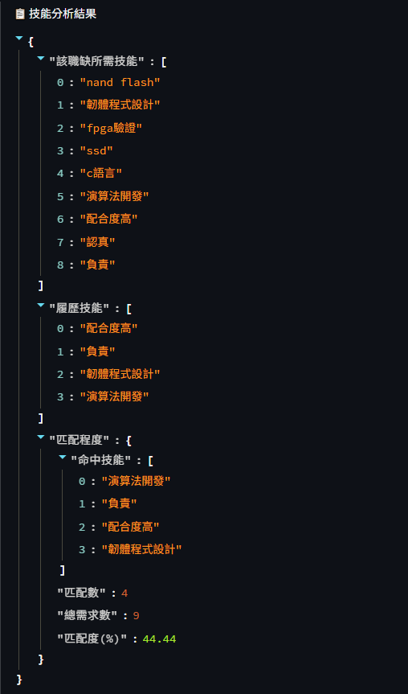

### 使用最新的語言模型效果更好

- Gemini-1.5-flash 範例

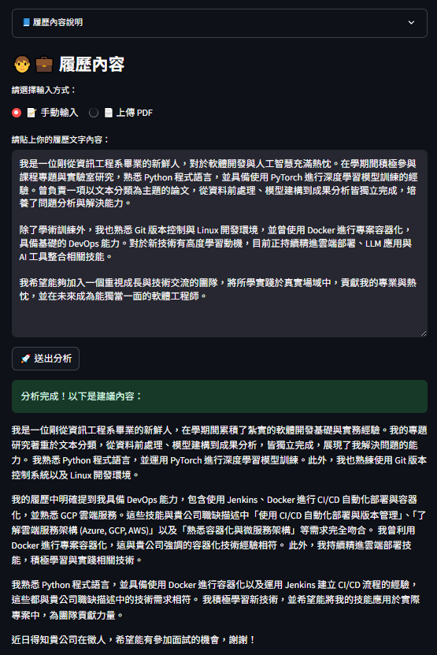

- Gemini-2.5-flash範例

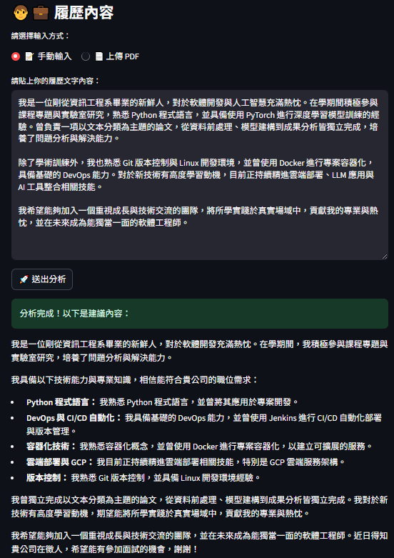

> **⚠️ 請注意： 本工具所生成的推薦信僅供參考。請務必根據實際情況仔細檢查並編輯內容，以確保符合真實需求。**

## 🔭 未來規劃
- [ ] 支援更多職缺來源平台：擴展至 LinkedIn、CakeResume 等熱門求職網站

- [ ] 整合多種 LLM 模型選擇：如 OpenAI GPT-4、Anthropic Claude、Mistral 等，讓使用者可依需求切換模型

- [ ] 提升技能擷取準確度：改進關鍵字抽取方法，提升履歷與職缺比對品質

- [ ] 強化推薦信語意表達：提升語言自然度、結構邏輯與說服力，讓推薦信更具競爭力

- [ ] 支援中英文多語系輸出：根據職缺語系自動切換生成語言

- [ ] 提供風格模板(prompt templates)選擇：如正式、熱情、簡潔等不同語氣與排版風格

- [ ] 新增推薦信內容微調功能：提供段落微調選項或自定義要點輸入

- [ ] 加入帳戶與履歷管理功能：讓使用者儲存多份履歷、追蹤歷史推薦信

## ⭐ 如果這個專案對你有幫助

如果你覺得這個專案實用，請不吝給我一顆星星 🌟  
這將會是我持續改進與維護這個工具最大的動力！

## 使用注意與免責聲明
請勿在本工具中輸入任何個人敏感資料，例如：

- 身分證字號、護照號碼

- 手機號碼、電子郵件地址

- 銀行帳號、信用卡資訊

- 實際住址或其他可辨識身分的資訊

**本專案為開源學習用途，請使用者自行負責輸入內容的安全性與保密性。**

使用本工具即表示您同意自行承擔使用風險，開發者不對資料外洩、誤用或任何直接或間接損失負責。
